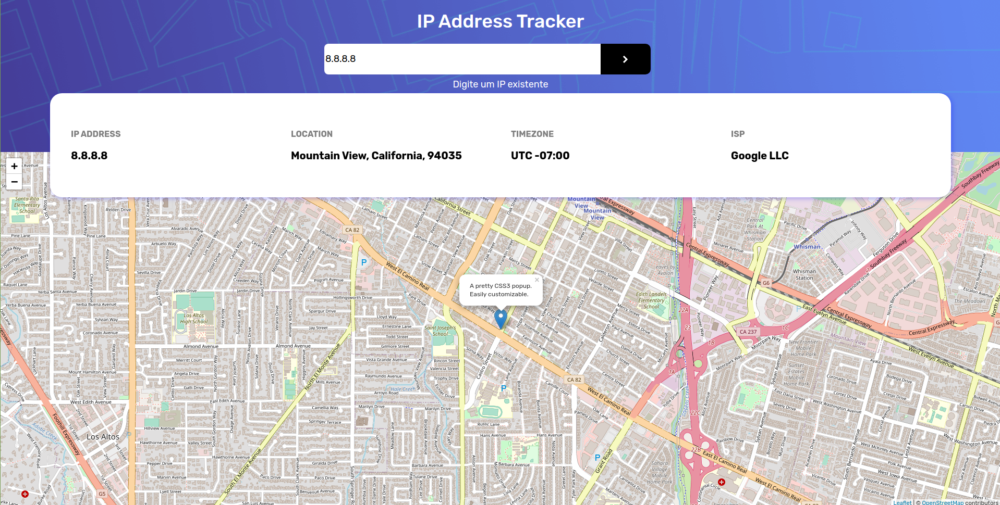

<h1 style="text-align: center;"> GeoIP Localization </h1>
<h1 style="text-align: center;"></h1>

## Sobre

Resultado de um desafio do site "Front End Mentor". É uma página web, nela há um campo onde você colocar seu IP, e, logo em seguida, aparecerá algumas informações sobre esse IP: timezone, localização no mapa, endereço e ISP.

## Tecnologias Utilizadas

- HTML
- CSS
- SASS
- Javascript
- Axios

## API'S Utilizadas

- IP Geolocation API

## Gerador de Mapas

- LeafletJS.
